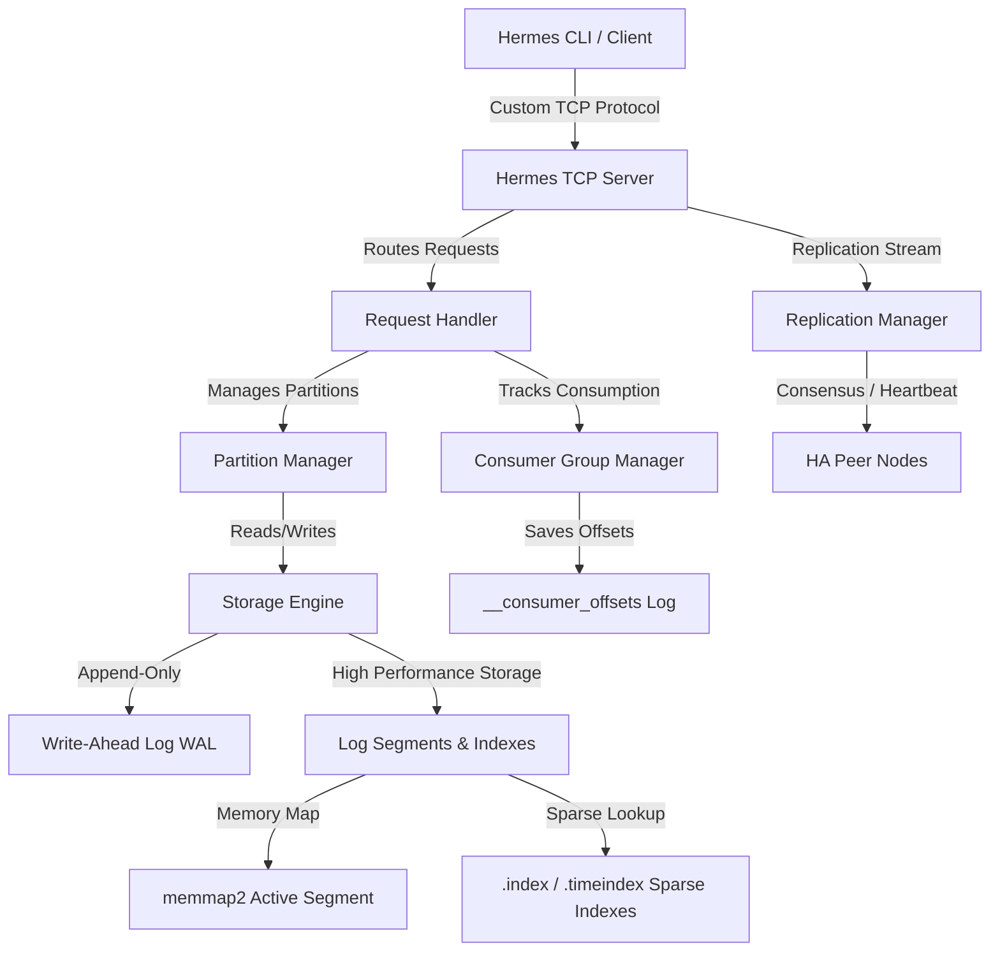

# Hermes ── High-Performance Event Streaming Engine

[](https://github.com/your-username/Hermes)
[](https://www.rust-lang.org/)
[](#license)

Hermes is a production-grade, highly available, distributed event streaming platform and storage engine built from scratch in Rust. Architected around append-only logs, sparse indexing, memory-mapped files, and consensus-driven replication, Hermes delivers Kafka-like features with the memory safety, concurrency, and performance of Rust.

---

## 🗺️ Architectural Overview

Hermes uses a clean, modular architecture. Client connections communicate via a custom binary TCP protocol to the Event Server, which coordinates with local storage and cluster peers.



### Key Highlights

*   **Log-Structured Storage & Indexing**: Segments are persisted as append-only data files. They use memory-mapped active segments (`memmap2`) for optimal performance, accompanied by sparse index (`.index`) and time-based index (`.timeindex`) files to allow $O(1)$ disk seek operations.
*   **Custom Binary Wire Protocol**: Implements a zero-copy framing codec with frame error checks (CRC32 validation) and specific request/response frames (`WireRequest`, `WireResponse`).
*   **Replication & High Availability**: Supports multi-node clusters with Leader-Follower roles, consensus validation (`HermesConsensus`), in-sync replicas (ISR) state tracking, and peer heartbeats.
*   **Transactional Isolation**: Facilitates atomic writes with a dedicated `TransactionManager` tracking state commits (`TxStatus`).
*   **Consumer Groups**: Features partition distribution, rebalancing, and committed offset tracking persisted to a system-wide `__consumer_offsets` partition.

---

## 📂 Project Structure

The codebase is structured logically, facilitating simple navigability:

| Directory/File | Description |
| :--- | :--- |
| [`src/main.rs`](src/main.rs) | Server entry point. Parses configuration, initializes storage, configures dual-destination tracing logs, and starts the TCP listener. |
| [`src/lib.rs`](src/lib.rs) | Root library module exposing public APIs for clients, replication, config, storage, and protocol codecs. |
| [`src/client.rs`](src/client.rs) | Test/production client containing APIs for Produce, Fetch, Seek, and Consumer Group registration. |
| [`src/config.rs`](src/config.rs) | Configurations parser (`EngineConfig`) supporting properties files and environment variables fallback. |
| [`src/consumer_group.rs`](src/consumer_group.rs) | Tracks active consumer group offsets and assigns partition ownership. |
| [`src/bin/hermes_cli.rs`](src/bin/hermes_cli.rs) | Core CLI application containing client control subcommands. |
| [`src/wal/`](src/wal/) | WAL engine that ensures durability and handles crash recovery logs. |
| [`src/segment/`](src/segment/) | Manages active and read-only storage segments (MMap log writers, sparse and time indexing). |
| [`src/server/`](src/server/) | Event loops, TCP connection handlers, partition coordinators, and transactional context. |
| [`src/protocol/`](src/protocol/) | Serialization & Deserialization codecs for wire commands and data frames. |
| [`src/replication/`](src/replication/) | Cluster coordination, leader election, metadata exchange, and follower fetch streams. |
| [`config/`](config/) | Configuration templates for node orchestration (Node 1, Node 2, Node 3). |
| [`tests/`](tests/) | Full-suite integration test scenarios verifying end-to-end event streaming workflows. |

---

## ⚡ Getting Started

### Prerequisites
*   **Rust Toolchain**: Install Rustup (`stable` channel recommended).
*   **Operating System**: Windows (optimizations via `windows-sys`) or POSIX-compliant systems (Linux/macOS).

### Configuration Setup
Copy or edit configurations in the [`config/`](config/) folder. Here is a typical Kafka-style `.properties` configuration:

```properties
cluster.id=hermes-prod-cluster-01
node.id=1
role=leader
listeners=PLAINTEXT://127.0.0.1:9092
log.dirs=./data_node1
logs.dir=./logs_node1
max.segment.bytes=10485760
replica.peer.addresses=127.0.0.1:9093,127.0.0.1:9094
min.insync.replicas=1
# Optional per-client (source IP) byte-rate quotas — unset means unlimited.
# Exceeding requests are delayed (not rejected), matching Kafka's throttling model.
quota.producer.default.bytes.per.second=10485760
quota.consumer.default.bytes.per.second=10485760
```

### Running the Broker Server
Start the Hermes broker with a configuration file:

```bash
cargo run --bin hermes -- ./config/server-node1.properties
```

Or configure using environment variables:
```bash
$env:HERMES_BIND_ADDR="127.0.0.1:9092"
$env:HERMES_DATA_DIR="./data_store"
cargo run --bin hermes
```

---

## 🛠️ CLI Client Usage Guide

Hermes provides a powerful command-line interface (`hermes_cli`) to interact with running brokers.

```bash
# General Syntax
cargo run --bin hermes_cli -- [--server <IP:PORT>] <COMMAND> [FLAGS]
```

### 1. Produce Messages
Produce event payloads to a specific topic. Partitions are automatically hashed based on the provided `--key`.

```bash
cargo run --bin hermes_cli -- produce --topic orders --key "user_94" --message "{\"amount\": 42.5}" --partitions 4
```

### 2. Fetch / Consume Messages
Fetch records starting at a specific logical offset. Include a consumer `--group` to persist commits.

```bash
# Read from offset 0
cargo run --bin hermes_cli -- fetch --topic orders --partition 0 --offset 0

# Read from beginning with Group Offset Commit tracking
cargo run --bin hermes_cli -- fetch --topic orders --partition 0 --group billing_processors --from-beginning
```

### 3. Continuous Group Polling
Run a continuous consumer polling loop that fetches new events automatically and auto-commits the offsets.

```bash
cargo run --bin hermes_cli -- group-consume --group analytics_group --topic orders --partition 0 --interval 500
```

### 4. Fetch Index Positions (Seek)
Retrieve the physical byte offset on disk for a given logical offset using the sparse index.

```bash
cargo run --bin hermes_cli -- seek --topic orders --partition 0 --offset 12
```

### 5. Management Commands
Check high-watermark offsets and committed partition coordinates.

```bash
# Retrieve high watermark offset
cargo run --bin hermes_cli -- latest-offset --topic orders --partition 0

# Fetch committed offset for a group
cargo run --bin hermes_cli -- fetch-offset --group billing_processors --topic orders --partition 0
```

---

## 🧪 Testing

Hermes uses a robust integration suite to test multi-node scenarios, failovers, transactions, and index searches. To run all tests, use:

```bash
cargo test
```

> [!NOTE]
> Integration tests automatically spin up ephemeral TCP servers bound to dynamic ports (`127.0.0.1:0`) and clean up all data stores on completion.

---

## 🤝 Contributing to Hermes

We welcome contributions to make Hermes even better! Follow this guide to set up the repository for public contribution on GitHub.

### 🌟 Steps to Publish on GitHub as a Contributing Repository

If you are the maintainer setting up this repository on GitHub:

1.  **Initialize Git & Add Remote**:
    ```bash
    git init
    git add .
    git commit -m "Initial commit of Hermes source code"
    git branch -M main
    git remote add origin https://github.com/your-organization/hermes.git
    git push -u origin main
    ```
2.  **Enable GitHub Features**:
    *   Under **Repository Settings**, enable **Issues** and **Pull Requests**.
    *   Set up **Branch Protection Rules** for `main` to require linear histories and passing status checks.
3.  **Add CI/CD Integration**:
    Create `.github/workflows/ci.yml` to automatically run tests and code linting on every push or Pull Request.

### 💻 Local Developer Setup

1.  **Fork the Repository**: Click the **Fork** button at the top-right of the GitHub repository page.
2.  **Clone Your Fork**:
    ```git
    git clone https://github.com/your-username/hermes.git
    cd hermes
    ```
3.  **Create a Branch**: Create a descriptive topic branch for your changes:
    ```bash
    git checkout -b feature/your-awesome-feature
    # or
    git checkout -b fix/issue-name
    ```

### 📝 Development Guidelines

To keep the repository clean and stable, please adhere to the following standards:

#### 1. Code Formatting & Linting
We enforce standard Rust styling. Run these commands before committing code:
```bash
cargo fmt --all -- --check
cargo clippy --all-targets -- -D warnings
```

#### 2. Writing and Running Tests
*   Ensure that all changes are backed by relevant tests.
*   If adding new storage/server features, write integration scenarios in the [`tests/integration_tests.rs`](tests/integration_tests.rs) file.
*   Validate that all tests execute cleanly:
    ```bash
    cargo test
    ```

#### 3. Commit Message Convention
We recommend descriptive commit messages following the [Conventional Commits](https://www.conventionalcommits.org/) standard:
*   `feat: add compression support for segment blocks`
*   `fix: resolve race condition in consumer group rebalance`
*   `docs: update readme with multi-node clustering guide`

#### 4. Submitting a Pull Request (PR)
1.  Push your branch to your GitHub fork:
    ```bash
    git push origin feature/your-awesome-feature
    ```
2.  Navigate to the original Hermes repository on GitHub.
3.  Click **New Pull Request**, select your fork's branch, and provide a clear description of the modifications.
4.  Await review! Our maintainers will review the PR, run tests on CI/CD, and merge it.

---

## 📄 License

This project is licensed under the terms of both the **MIT License** and the **Apache License (Version 2.0)**. You may choose to use either license at your discretion.
