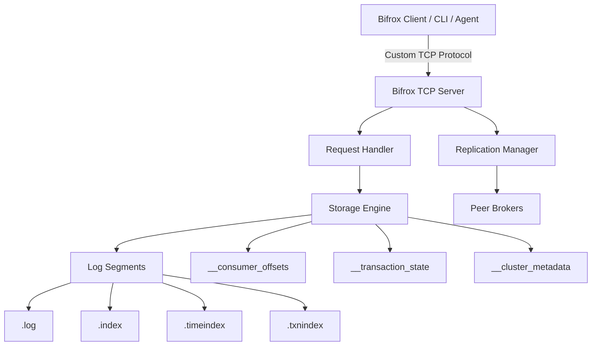

# Bifrox

Bifrox is a distributed event streaming broker written in Rust. It focuses on Kafka-like
broker semantics, Windows-friendly operation, and a custom binary protocol that you can
build dedicated clients against.

## What Bifrox already has

### Core broker features

- Append-only log storage with sparse offset indexes
- Time-based lookups with `.timeindex`
- Aborted-transaction tracking with `.txnindex`
- Multi-topic, multi-partition storage
- Key-based partition routing
- Read-uncommitted and read-committed fetch paths
- Consumer-group membership, heartbeats, sync, leave, and committed offsets
- Topic creation, deletion, description, and listing
- Cluster metadata and dynamic broker registration

### Reliability and replication

- Leader/follower replication
- ISR-aware writes with `min.insync.replicas`
- Partition-level leadership
- Produce forwarding to the current partition leader
- Metadata-log replay on restart
- Transaction-state replay on restart
- Durable `transactional.id -> producer_id / producer_epoch` fencing state
- Windows-safe segment and file handling

### Transactions and idempotence

- Idempotent producer sequencing
- `InitProducerId`, `AddPartitionsToTxn`, and `EndTxn`
- Legacy `BeginTx`, `CommitTx`, and `AbortTx`
- Read-committed isolation
- Durable transaction partition registration
- Producer epoch fencing after restart or re-initialization

### Security and access control

- TLS / SSL transport
- SASL PLAIN
- SASL SCRAM-SHA-256
- ACL-based authorization
- Persistent SCRAM verifier storage in cluster metadata
- Bootstrap `sasl.user.*` support for seed users and recovery

### Performance and operations

- LZ4 record payload compression
- Per-client / per-principal quota throttling
- Logical `client_id` support for better quota identity
- Prometheus `/metrics` endpoint
- Windows CI and Windows packaging guidance

## Important protocol note

Bifrox does **not** currently position itself as a drop-in Kafka wire-compatible broker.
It exposes a custom TCP protocol and is designed to support purpose-built Bifrox clients.

If you are building a client or agent, start with
[docs/BIFROX_CLIENT_CREATOR_REFERENCE.md](docs/BIFROX_CLIENT_CREATOR_REFERENCE.md).

## Architecture at a glance



## Repository layout

| Path | Purpose |
| --- | --- |
| [`src/main.rs`](src/main.rs) | Broker entry point |
| [`src/lib.rs`](src/lib.rs) | Library root and public exports |
| [`src/client.rs`](src/client.rs) | Reference client implementation |
| [`src/config.rs`](src/config.rs) | Broker configuration parsing |
| [`src/consumer_group.rs`](src/consumer_group.rs) | Consumer offset persistence |
| [`src/protocol/`](src/protocol/) | Wire protocol and record framing |
| [`src/server/`](src/server/) | Request handling, transactions, ACLs, quotas, listener |
| [`src/segment/`](src/segment/) | Log segments and indexes |
| [`src/replication/`](src/replication/) | Metadata and replication logic |
| [`tests/integration_tests.rs`](tests/integration_tests.rs) | End-to-end scenarios |
| [`packaging/windows/`](packaging/windows/) | Windows deployment notes |
| [`docs/`](docs/) | Reference and roadmap documents |

## Quick start

### Prerequisites

- Rust stable
- Windows, Linux, or macOS

### Example configuration

```properties
cluster.id=bifrox-prod-cluster-01
node.id=1
role=leader
listeners=PLAINTEXT://127.0.0.1:9092
log.dirs=./data_node1
logs.dir=./logs_node1
max.segment.bytes=10485760
replica.peer.addresses=127.0.0.1:9093,127.0.0.1:9094
min.insync.replicas=1

# Quotas
quota.producer.default.bytes.per.second=10485760
quota.consumer.default.bytes.per.second=10485760

# Metrics
metrics.bind.address=127.0.0.1:10092

# Security bootstrap user
sasl.user.admin=change-me
```

### Run the broker

```powershell
cargo run --bin bifrox -- .\config\server-node1.properties
```

Or with environment variables:

```powershell
$env:BIFROX_BIND_ADDR="127.0.0.1:9092"
$env:BIFROX_DATA_DIR=".\data_store"
cargo run --bin bifrox
```

## Security model

Bifrox supports multiple deployment styles:

- `PLAINTEXT`
- `SASL_PLAINTEXT`
- `SSL`
- `SASL_SSL`

For SASL-enabled deployments:

- `PLAIN` and `SCRAM-SHA-256` are supported.
- SCRAM authentication uses persistent verifier material, not plaintext-at-auth-time
  password lookup.
- `sasl.user.*` entries are treated as bootstrap seed users and imported into the
  persistent store if that user is not already present.

ACLs can be enabled for topic, group, transactional-id, and cluster operations.

## Quotas and client identity

Bifrox supports Kafka-style throttling behavior: clients are delayed instead of being
hard-rejected when they exceed byte-rate quotas.

Quota identity precedence is:

1. authenticated principal + logical `client_id`
2. logical `client_id`
3. authenticated principal
4. source IP fallback

Clients can set a connection-scoped logical `client_id` early in the session to get
more stable quota behavior.

## Transaction behavior

Bifrox supports both:

- legacy transaction commands (`BeginTx`, `CommitTx`, `AbortTx`)
- producer-ID-based EOS flow (`InitProducerId`, `AddPartitionsToTxn`, `EndTxn`)

Recent hardening includes:

- durable producer ID / epoch registration
- epoch fencing for stale producers
- durable transaction partition registration
- restart recovery of active and prepare transaction states
- read-committed filtering for uncommitted and aborted data

## Metrics and observability

Bifrox exposes Prometheus metrics through `/metrics`, including:

- produce bytes and records
- fetch bytes
- active connections
- topic count
- active broker count
- quota throttles
- ACL denials

## Windows notes

Bifrox is actively hardened for Windows:

- Windows file-sharing safe segment handling
- Windows CI coverage
- Windows packaging notes in [packaging/windows/README.md](packaging/windows/README.md)

## Testing and quality checks

```powershell
cargo fmt --all -- --check
cargo clippy --all-targets -- -D warnings
cargo test
```

The integration suite covers replication, transactions, security, quotas, metrics,
restart recovery, and Windows-relevant storage behavior.

## Contributing

See [CONTRIBUTING.md](CONTRIBUTING.md).

## License

Bifrox is dual-licensed under MIT or Apache-2.0.
